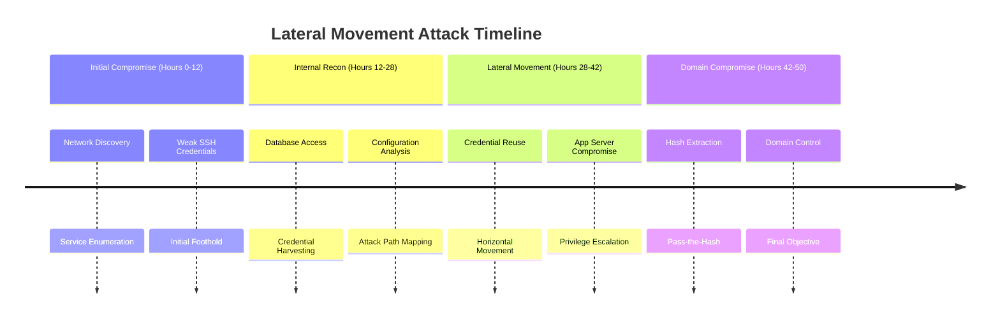

# Executive Summary

## 📋 Engagement Overview

| | |
|------|------|
| **Test Type** | Internal Network Penetration Test |
| **Dates Conducted** | August 15-20, 2025 |
| **Target Scope** | Internal network segment 192.168.78.0/24 |
| **Objective** | Assess lateral movement risks and privilege escalation paths |
| **Overall Risk Rating** | **CRITICAL** |

## 🚨 Key Findings

### Critical Risks Identified
1. **Domain Administrator Compromise** - Complete network control achieved
2. **Credential Reuse Across Systems** - Enabled rapid lateral movement  
3. **Weak Service Account Passwords** - Initial foothold established
4. **Inadequate Network Segmentation** - No barriers to lateral movement

### Business Impact Analysis
- **Data Exposure**: Customer databases, financial records, HR documents
- **Operational Risk**: Complete business disruption potential
- **Compliance Implications**: GDPR, SOX, PCI-DSS violations
- **Reputational Damage**: Loss of customer trust and brand integrity

## 📈 Attack Timeline

---

---

## 🎯 Security Posture Assessment

**Overall Security Rating:** Poor  

| Security Control | Effectiveness | Recommendation |
|------------------|---------------|----------------|
| Credential Management | ❌ Ineffective | Implement MFA & strong policies |
| Network Segmentation | ❌ Nonexistent | Implement tier separation |
| Privileged Access | ❌ Weak | Deploy PAM solutions |
| Monitoring & Detection | ⚠️ Limited | Enhance SIEM capabilities |

---

## 💡 Priority Recommendations

### Immediate (0-7 days)
- Enforce strong password policies for all service accounts  
- Eliminate credential reuse across systems and applications  

### Short-term (7-30 days)
- Implement network segmentation between application tiers  
- Deploy Multi-Factor Authentication for administrative access  

### Long-term (30-90 days)
- Implement Privileged Access Management (PAM) solution  
- Enhance monitoring for lateral movement detection  

---

## 📞 Conclusion

This engagement demonstrated critical weaknesses in the organization's internal security controls. The rapid progression from initial compromise to complete domain control highlights the urgent need for improved credential management and network segmentation.  

**Next Steps:** Review detailed technical findings and coordinate remediation efforts with the IT security team.  

<em>Confidential - For Internal Use Only</em>

---

## 🔍 Quick Navigation

- [Back to Project Hub](../enterprise-network-%26-domain-compromise)
- [Technical Report](technical-report.md)
- [Findings & Remediation](findings-remediation.md)
- [Evidence & Documentation](evidence/README.md)
- [Methodology](methodology/README.md)
